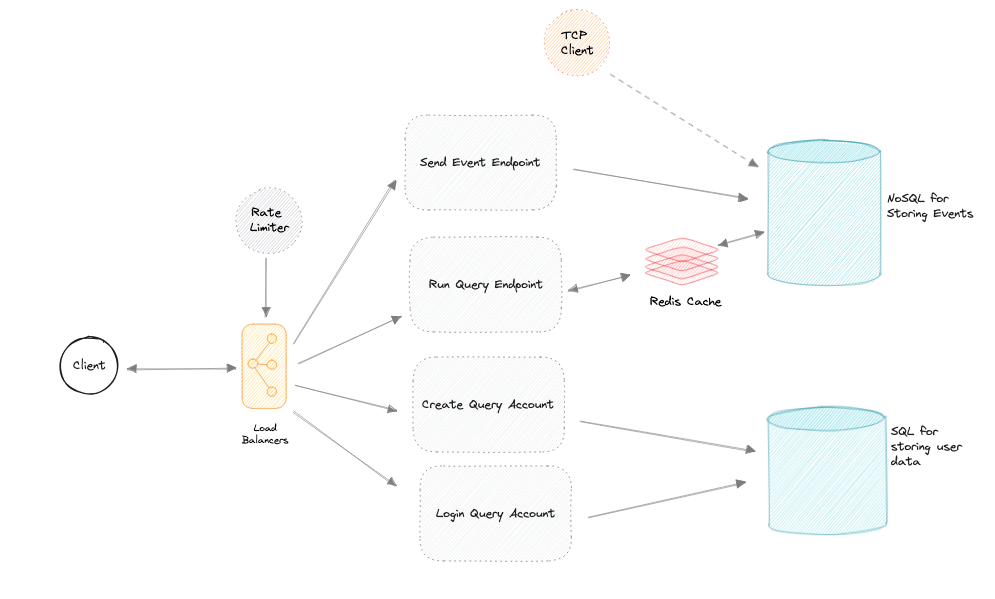

## Audit Event Log Service

**System for receiving events of any structure, and querying them**



### Overview

There are two main components

1. Service for accepting events
2. Service for querying events

Then there are features:

1. Authentication
2. Exposable via a http endpoint

### Approach

There are 8 files (minus the .sh scripts):

1. auditlogeventservice
2. auditlogcustomerservice
3. docker-compose
4. imageforreadme
5. readme
6. .env
7. nginx
8. db-init-scripts

The http endpoint version is in `auditlogcustomerservice`, it can be deployed using the `docker-compose` file, and tested using the `.sh` scripts.

The reason there is an `auditlogeventservice` file

*The events will be received from different systems which can send them at any time. A http endpoint will not be the best way to approach this, rather a TCP connection to these systems will be better. This is why there is an `auditlogeventservice`. It contains a tcp listener. A TCP listener is faster than a http one, and ensures correct order of events, this will help us to treat the event reception as a stream and handle as appropriate*


Looking at the `docker-compose.yml` file, you will see various services
1. auditlogcustomerservice - where the application is contained
2. mongodb - choice database for storing events. The reason for this choice is the flexibility of each entry. It can help create flexible events
3. mongoexpress - a GUI for viewing mongodb
4. postgres - choice database for storing user detail. The reason for this choice is the ability to make aggregations it brings to our data. For example, we may choose to store more user detail like location data, then we need to ask how many users are in that location?
5. pgadmin - a GUI for viewing postgres
6. redis - choice cache system for caching get queries
7. nginx - web server for deploying the application, deploys on port :80

In `auditlogcustomerservice`,
the `main.go` file

Contains four endpoints

1. CreateQueryAccount - For creating the user account that can send and query the database, returns a jwt token for authentication
```
API: http://localhost:80/api/v1/createuser (POST)
Receives: JSON(Username: string, Email: string, Password: string)
Response: JWT token
```

2. LoginQueryAccount - To log in a query account, returns a jwt token for authentication
```
API: http://localhost:80/api/v1/loginuser (POST)
Receives: JSON(Username: string, Password: string)
Response: JWT token
```

3. SubmitEvent: for submitting the event to the database
```
API: http://localhost:80/api/v1/submitevent (POST)
Receives: JSON()
Response: Map["event": "received"]
```

4. GetEvent: for querying the event
```
API: http://localhost:80/api/v1/getevents/{key}/{value} (GET)
Receives: None
Response: Map[event]
```

*All files with _test are test files for the appropriate methods*

the submitevent method is optimized using a buffered channel for temporarily storing event data until a threshold set in the .env file, then an `insertMany` operation is done on this number of events. I do this to ensure that I do not keep making calls to the database for each event that comes in. This method is also rate-limited using a custom rate-limiter

The getevent method is optimized by storing queries in a cache after it has been made. This is to ensure that I do not keep hitting the database for the same query. An expiration time of 1 hour is set for expiring the cached data. This method is also rate-limited using a custom rate-limiter

The overall application has versioning for the APIs


To deploy the application:

```
docker-compose up -d
```
This starts up all the applications defined in the docker-compose file as containers running on different ports. It also starts up an `nginx` web server that connects to the `auditlogcustomerservice` as entry point.
The `pgadmin` and `mongoexpress` are currently commented out. You can uncomment them before building the services to have a GUI for accessing the databases.

To test the application, there are five files that contain curl commands for the various endpoints

1. curl_createqueryaccount.sh - for creating an account to be used for authentication

2. curl_loginqueryaccount.sh - to login the account

3. curl_par_submitevent.sh - to submit events in parallel

4. curl_seq_submitevent.sh - to submit events sequentially

5. curl_testqueryendpoint.sh - to get events based on key-value

```
./curl_createqueryaccount.sh
./curl_loginqueryaccount.sh
./curl_par_submitevent.sh
./curl_seq_submitevent.sh
./curl_testqueryendpoint.sh
```

These files can also be executed directly
```
chmod +x ./curl_seq_submitevent.sh
./curl_seq_submitevent.sh     
```